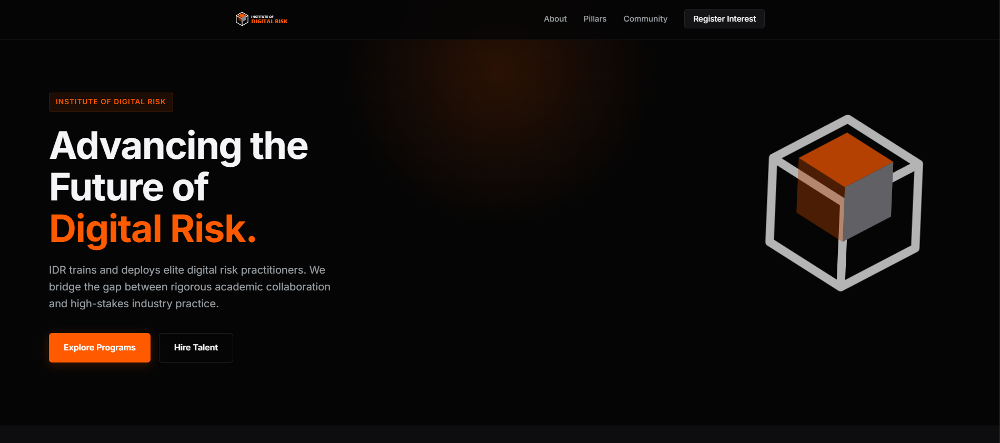
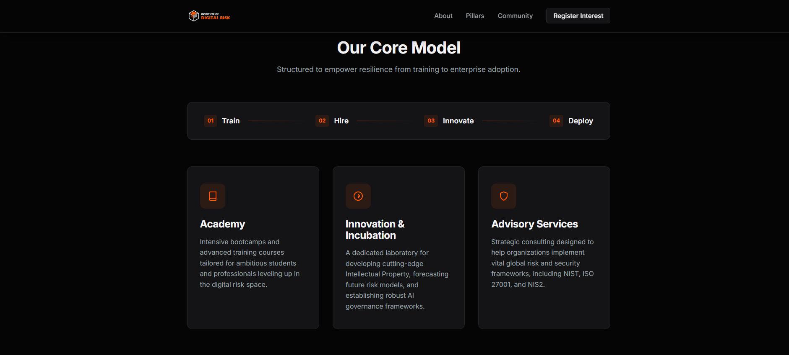
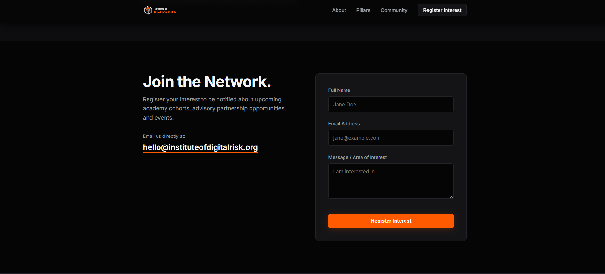

# 🛡️ Institute of Digital Risk (IDR) | Responsive Website

A modern **responsive single-page website** designed for the **Institute of Digital Risk (IDR)** — an industry-led training and deployment institute focused on **digital, cyber, and AI risk education**.

---

## 🚀 Project Overview
This project presents a professional homepage for **IDR**, highlighting its mission, services, and community.  
The website is designed with **clean UI, responsive layout, and modern web standards** to ensure accessibility across **desktop and mobile devices**.

---

## 🎯 Project Objectives
- Design a **minimalist technology-focused brand identity**
- Develop a **responsive homepage**
- Present the **training and deployment model of IDR**
- Demonstrate **modern frontend development practices**

---

## 🎨 Logo Design
The IDR logo uses a **cube-inspired geometric structure** representing **digital infrastructure, layered risk management, and resilience**.

### Design Concept
- **Orange** – Innovation, alertness, and digital transformation  
- **Black** – Strength, authority, and security  
- **White** – Simplicity, clarity, and trust  

Two logo variants were created:
- **Icon Only**
- **Icon + Text ("Institute of Digital Risk")**

---

## 🌐 Website Sections

### 🏠 Hero Section
- Mission statement of IDR  
- Short introduction to digital risk training  
- Call-to-action button

### ℹ️ About IDR
- Overview of the institute  
- Focus on **digital, cyber, and AI risk training**  
- Collaboration between **academic institutions and industry**

### 🧩 Service Pillars
Core operational model of IDR:

- **Academy**  
  Training programs and bootcamps for students and professionals

- **Innovation & Incubation**  
  Research, AI governance models, and new risk frameworks

- **Advisory Services**  
  Industry consulting and implementation of security frameworks such as:
  - NIST
  - ISO 27001
  - NIS2

### 👥 Community
The IDR community includes:

- Students
- Early-career professionals
- Cybersecurity practitioners
- Technology risk specialists
- Financial and critical infrastructure professionals

### 📩 Contact / Register Interest
Simple contact form allowing users to:

- Submit name
- Enter email
- Send a message or inquiry

---

## 🧰 Tech Stack

### Frontend
- HTML5
- CSS3
- JavaScript

### Design
- SVG Graphics (Logo)
- Google Fonts
- Responsive Layout (Flexbox & Grid)

---

## ⚙️ Key Features

- Responsive design (Mobile + Desktop)
- Sticky navigation bar
- Smooth scrolling navigation
- Clean minimalist UI
- Accessible color contrast
- Contact form UI
- Modern typography

---

## 📚 Learning Outcomes

- Responsive website design
- Semantic HTML structure
- UI/UX design principles
- CSS layout techniques (Flexbox/Grid)
- Frontend project structuring
- Branding and logo design

---

## 📸 Project Screenshots

### 🏠 Hero

###

### 🧩

---
